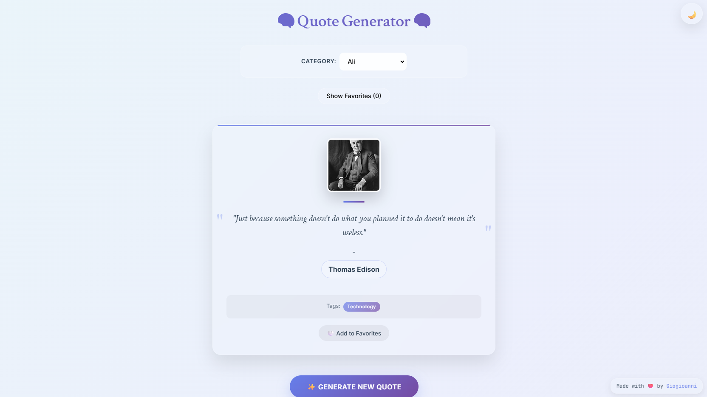
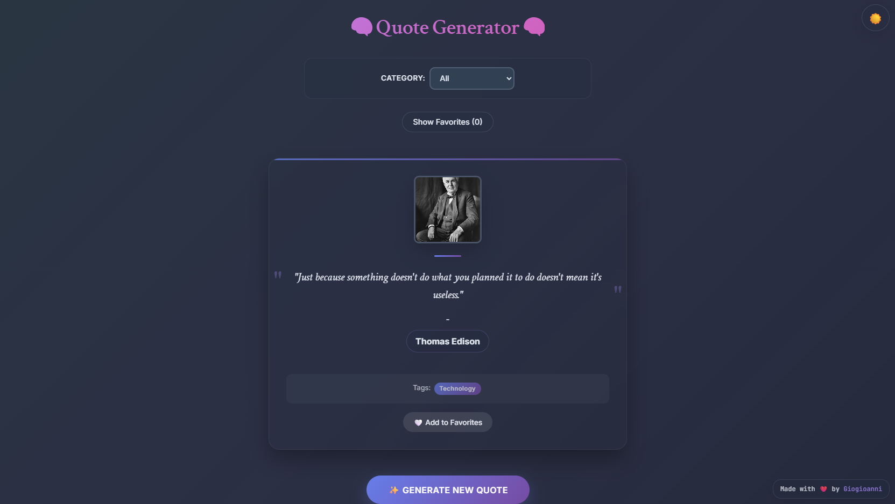

# ✨ Quote Quest ✨

> A modern, elegant web application built with React and Vite that generates inspiring quotes from various categories with Wikipedia integration and favorites functionality.

## 🚀 Live Demo

**[✨ Try it Live](https://giogioanni.github.io/quote-it)**

## 📸 Screenshots

### Light Theme

### Dark Theme  

## ✨ Features

### 🎯 Core Functionality
- **Random Quote Generation** - Fetch inspiring quotes from the Quotable API
- **Category Filtering** - Browse quotes by motivation, wisdom, success, and more
- **Favorites System** - Save and manage your favorite quotes with localStorage
- **Wikipedia Integration** - Click author names to learn more on Wikipedia
- **Real-time Author Images** - Dynamic author photos from Wikipedia API

### 🎨 Design & UX
- **Dual Theme Support** - Elegant light and dark mode toggle
- **Glass-morphism Design** - Modern frosted glass aesthetic
- **Responsive Layout** - Optimized for desktop, tablet, and mobile
- **Smooth Animations** - Polished transitions and micro-interactions
- **Academic Typography** - Professional serif and sans-serif font pairing

### ⚡ Technical Features
- **Fast Loading** - Built with Vite for optimal performance
- **Component Architecture** - Clean, maintainable React code
- **Modern CSS** - CSS Variables, Flexbox, Grid, and animations
- **API Integration** - RESTful API consumption with error handling
- **Local Storage** - Persistent favorites across sessions

## 🛠️ Tech Stack

### Frontend
- **React 18** - Modern React with hooks and functional components
- **JavaScript ES6+** - Modern JavaScript features
- **CSS3** - Advanced styling with custom properties and animations
- **Vite** - Next-generation frontend tooling

### APIs & External Services
- **[Quotable API](https://github.com/lukePeavey/quotable)** - Quote data and metadata
- **[Wikipedia REST API](https://en.wikipedia.org/api/rest_v1/)** - Author information and images
- **[UI Avatars](https://ui-avatars.com/)** - Fallback avatar generation

### Development Tools
- **ESLint** - Code linting and quality
- **Modern Browser APIs** - localStorage, fetch, async/awai

## 🎨 My Design Philosophy

This application showcases modern web development principles:

- **User-Centric Design** - Intuitive interface with clear visual hierarchy
- **Performance First** - Optimized loading and smooth interactions
- **Accessibility** - Semantic HTML and keyboard navigation support
- **Responsive Design** - Mobile-first approach with progressive enhancement
- **Visual Consistency** - Cohesive design system with branded color palette

## 📱 Responsive Breakpoints

- **Mobile**: < 768px
- **Tablet**: 768px - 1024px  
- **Desktop**: > 1024px

## 🤝 Contributing

1. Fork the repository
2. Create your feature branch (`git checkout -b feature/AmazingFeature`)
3. Commit your changes (`git commit -m 'Add some AmazingFeature'`)
4. Push to the branch (`git push origin feature/AmazingFeature`)
5. Open a Pull Request

## 📋 Some Future Enhancements

- [ ] Quote sharing to social media
- [ ] Custom quote categories
- [ ] Export favorites as PDF
- [ ] Quote of the day notifications
- [ ] Multi-language support
- [ ] Advanced search functionality
- [ ] User accounts and cloud sync

## 🐛 Known buggies

- Wikipedia images may occasionally fail to load due to CORS restrictions
- Some quotes may have incomplete metadata from the API

## 📄 License

This project is licensed under the MIT License - see the [LICENSE](LICENSE) file for details.

## 👨‍💻 Who am i?

**Giogioanni**
- GitHub: [@Giogioanni](https://github.com/Giogioanni)
- Portfolio: [View Live Projects](https://github.com/Giogioanni?tab=repositories)

## 🙏 Acknowledgments

- [Quotable API](https://github.com/lukePeavey/quotable) for providing the quote data
- [Wikipedia](https://www.wikipedia.org/) for author information and images
- [React Team](https://reactjs.org/) for the amazing framework
- [Vite Team](https://vitejs.dev/) for the blazing fast build tool

---
*Built with ❤️*
